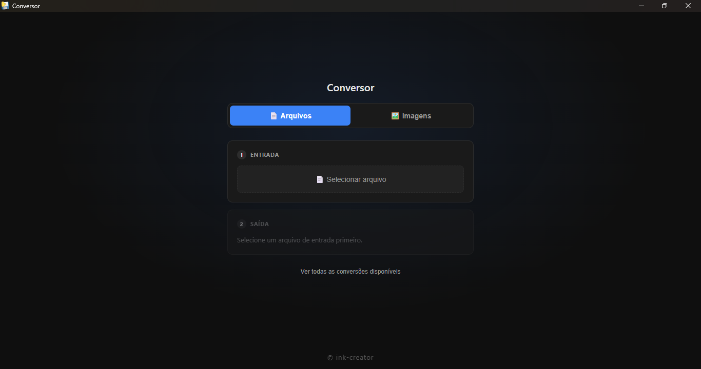
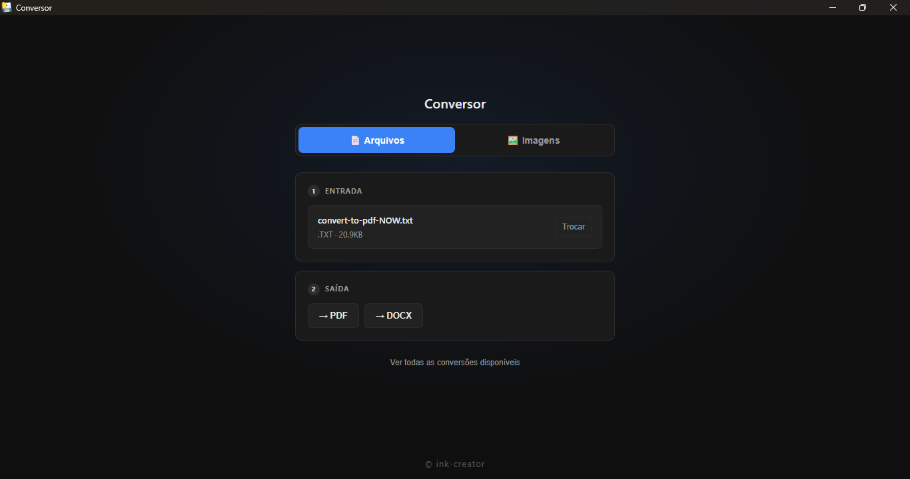
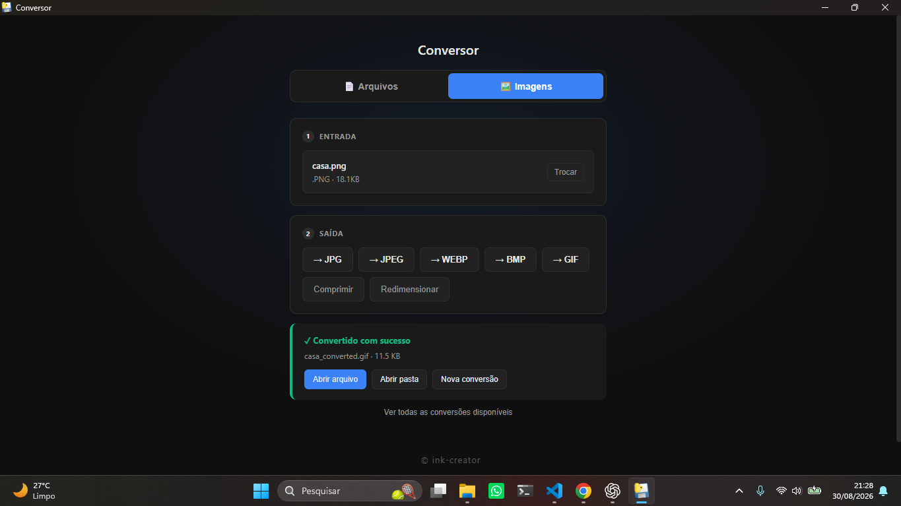

# File Converter / Conversor de Arquivos


A desktop file converter built with **Python and pywebview**, supporting documents, structured data and images through a simple graphical interface.

[English](#english) · [Português](#português)

---

## Demo

<!--
Edit this README through GitHub and drag your MP4 below.
GitHub will upload it and generate a github.com/user-attachments/... URL.
Leave that URL alone on its own line.
-->

---

## Preview

<table>
  <tr>
    <td align="center" colspan="2">
      <strong>File Converter</strong><br><br>
      
    </td>
  </tr>
  <tr>
    <td align="center" width="50%">
      <strong>Document Conversion</strong><br><br>
      
    </td>
    <td align="center" width="50%">
      <strong>Image Conversion & Tools</strong><br><br>
      
    </td>
  </tr>
</table>

---

# English

## About

**File Converter** is a desktop application designed to make common file conversions simple and accessible.

It combines a web-based interface with a Python backend using **pywebview**, allowing the application to run inside its own desktop window without requiring the user to interact with a terminal or browser.

The project supports three main categories:

- Documents
- Structured data
- Images

---

## Features

### Documents

Supported document formats include:

- TXT
- PDF
- DOCX
- HTML
- RTF

Available conversions include:

```text
TXT  → PDF
TXT  → DOCX

PDF  → TXT
PDF  → DOCX

DOCX → TXT
DOCX → PDF

HTML → PDF
HTML → TXT

RTF  → TXT
```

> [!NOTE]
> PDF and DOCX conversions are primarily text and paragraph based.
> Complex layouts, columns and advanced tables may not be preserved exactly.

---

### Structured Data

The application also supports conversion between common structured-data formats:

- CSV
- JSON
- XML
- XLSX
- YAML

Available conversions include:

```text
CSV  ↔ JSON
CSV  ↔ XML
CSV  ↔ XLSX

JSON ↔ XML
JSON ↔ XLSX
JSON ↔ YAML

XML  ↔ YAML

XLSX ↔ JSON
```

This makes it useful for quickly moving data between formats used by spreadsheets, APIs and configuration files.

---

### Images

Supported image formats include:

- PNG
- JPG
- JPEG
- WEBP
- BMP
- GIF

Images can be converted between supported formats directly from the application.

---

## Image Tools

In addition to format conversion, the Images tab includes dedicated image-processing tools.

### Compression

Images can be compressed using an adjustable quality value.

The application displays the size reduction after the operation.

### Resize

Images can also be resized by specifying:

- Width
- Height
- Whether the original aspect ratio should be preserved

---

## Simple Conversion Workflow

The interface is designed around a short workflow:

```text
Select file
     ↓
Detect format
     ↓
Show compatible outputs
     ↓
Choose conversion
     ↓
Convert automatically
     ↓
Open file or folder
```

There is no separate confirmation step after choosing the output format.

---

## Smart Format Detection

When a file is selected, the application reads its extension and automatically displays only the conversions compatible with that format.

If a file belonging to the other category is selected, the interface can suggest switching to the appropriate tab.

---

## Conversion Reference

The **View all available conversions** option displays the complete conversion list supported by the application.

The list is generated from the application's own conversion map, helping keep the interface consistent with the formats actually supported by the backend.

---

## After Conversion

When a conversion finishes successfully, the application provides shortcuts to:

- Open the converted file
- Open the folder containing it
- Start a new conversion

Converted files are saved next to the original file.

Existing files are not intentionally overwritten.

Generated filenames use suffixes such as:

```text
_converted
_compressed
_resized
```

depending on the operation performed.

---

## Desktop Application

The interface runs through **pywebview**, combining an HTML/CSS/JavaScript frontend with Python functionality.

The application opens in its own native desktop window instead of requiring the user to manually open a browser page.

On Windows, pywebview uses the installed WebView environment.

> [!NOTE]
> On most updated Windows 10 and Windows 11 installations, Microsoft Edge WebView2 is already available.
>
> If the application opens with a blank window, installing the Microsoft Edge WebView2 Runtime may resolve the issue.

---

## Running from Source

### Requirements

- Python
- pip

Clone the repository:

```bash
git clone https://github.com/ink-creator/Conversor-arquivos.git
cd Conversor-arquivos
```

Install the dependencies:

```bash
pip install -r requirements.txt
```

Run the application:

```bash
python app.py
```

---

## Building the Executable

The repository includes a PyInstaller configuration:

```text
build.spec
```

Install the project dependencies and run:

```bash
pyinstaller build.spec
```

The configuration creates a standalone graphical executable and bundles the interface files required by the application.

The generated application does not open a separate console window.

---

## Main Dependencies

The project uses:

- pywebview
- Pillow
- python-docx
- pypdf
- xhtml2pdf
- striprtf
- openpyxl
- PyYAML
- PyInstaller

---

## Technologies

The application combines:

- Python
- HTML
- CSS
- JavaScript
- pywebview
- PyInstaller
- File system APIs
- Document processing libraries
- Image processing libraries

---

## Project Structure

```text
Conversor-arquivos/
├── assets/
│   └── screenshots/
│       ├── files-overview.png
│       ├── files-conversion.png
│       └── images-conversion.png
│
├── converters/
│   ├── document.py
│   ├── data.py
│   └── image.py
│
├── interface/
│   └── Application interface
│
├── logs/
│
├── utils/
│   └── Shared helpers and configuration
│
├── app.py
├── build.spec
├── requirements.txt
├── .gitignore
├── LICENSE
└── README.md
```

---

## Purpose

This project was created to provide a simple desktop interface for file conversion while also exploring:

- Python desktop applications
- pywebview integration
- File manipulation
- Document processing
- Structured-data conversion
- Image processing
- Packaging Python applications as executables

The goal is to keep the application simple for the end user while handling the conversion logic internally.

---

# Português

## Sobre

O **Conversor de Arquivos** é uma aplicação desktop criada para facilitar conversões comuns de arquivos através de uma interface gráfica simples.

O projeto combina uma interface web com um backend em Python utilizando **pywebview**, permitindo executar a aplicação em uma janela própria sem exigir que o usuário utilize terminal ou navegador manualmente.

O programa trabalha com três categorias principais:

- Documentos
- Dados estruturados
- Imagens

---

## Funcionalidades

### Documentos

Entre os formatos de documentos suportados estão:

- TXT
- PDF
- DOCX
- HTML
- RTF

As conversões disponíveis incluem:

```text
TXT  → PDF
TXT  → DOCX

PDF  → TXT
PDF  → DOCX

DOCX → TXT
DOCX → PDF

HTML → PDF
HTML → TXT

RTF  → TXT
```

> [!NOTE]
> As conversões de PDF e DOCX são principalmente baseadas em texto e parágrafos.
> Layouts complexos, colunas e tabelas avançadas podem não ser preservados exatamente.

---

### Dados Estruturados

A aplicação também permite converter formatos comuns de dados:

- CSV
- JSON
- XML
- XLSX
- YAML

As conversões disponíveis incluem:

```text
CSV  ↔ JSON
CSV  ↔ XML
CSV  ↔ XLSX

JSON ↔ XML
JSON ↔ XLSX
JSON ↔ YAML

XML  ↔ YAML

XLSX ↔ JSON
```

Isso permite mover rapidamente informações entre formatos utilizados por planilhas, APIs e arquivos de configuração.

---

### Imagens

Os formatos de imagem suportados incluem:

- PNG
- JPG
- JPEG
- WEBP
- BMP
- GIF

As imagens podem ser convertidas entre os formatos disponíveis diretamente pela aplicação.

---

## Ferramentas de Imagem

Além da conversão de formatos, a aba de imagens possui ferramentas específicas de processamento.

### Compressão

Imagens podem ser comprimidas utilizando um nível de qualidade ajustável.

Após a operação, o programa pode informar a redução obtida no tamanho do arquivo.

### Redimensionamento

Também é possível redimensionar imagens definindo:

- Largura
- Altura
- Manutenção ou não da proporção original

---

## Fluxo de Conversão

A interface foi pensada para utilizar poucos passos:

```text
Selecionar arquivo
       ↓
Detectar formato
       ↓
Mostrar saídas compatíveis
       ↓
Escolher conversão
       ↓
Converter automaticamente
       ↓
Abrir arquivo ou pasta
```

Não existe um botão adicional de confirmação após selecionar o formato de saída.

---

## Detecção Automática

Ao selecionar um arquivo, o aplicativo detecta sua extensão e mostra automaticamente apenas as conversões compatíveis com aquele formato.

Caso um arquivo pertencente à outra categoria seja selecionado, a interface pode sugerir a mudança para a aba correspondente.

---

## Lista de Conversões

A opção **Ver todas as conversões disponíveis** mostra a lista completa de conversões suportadas pelo programa.

Essa lista é gerada utilizando o próprio mapa de conversões da aplicação, ajudando a manter a interface de acordo com as funcionalidades realmente disponíveis no backend.

---

## Depois da Conversão

Quando uma conversão termina com sucesso, a aplicação oferece atalhos para:

- Abrir o arquivo convertido
- Abrir a pasta onde ele foi salvo
- Iniciar uma nova conversão

Os arquivos convertidos são salvos ao lado do arquivo original.

Os arquivos existentes não são sobrescritos intencionalmente.

Dependendo da operação, o nome recebe sufixos como:

```text
_converted
_compressed
_resized
```

---

## Aplicação Desktop

A interface funciona através do **pywebview**, combinando HTML, CSS e JavaScript com as funcionalidades implementadas em Python.

O programa abre em uma janela desktop própria, sem exigir que o usuário abra uma página manualmente no navegador.

No Windows, o pywebview utiliza o ambiente WebView disponível no sistema.

> [!NOTE]
> Na maioria das instalações atualizadas do Windows 10 e Windows 11, o Microsoft Edge WebView2 já está instalado.
>
> Caso o programa abra uma janela vazia, instalar o Microsoft Edge WebView2 Runtime pode resolver o problema.

---

## Executando pelo Código-Fonte

### Requisitos

- Python
- pip

Clone o repositório:

```bash
git clone https://github.com/ink-creator/Conversor-arquivos.git
cd Conversor-arquivos
```

Instale as dependências:

```bash
pip install -r requirements.txt
```

Execute:

```bash
python app.py
```

---

## Gerando o Executável

O repositório já possui uma configuração do PyInstaller:

```text
build.spec
```

Depois de instalar as dependências, execute:

```bash
pyinstaller build.spec
```

A configuração gera um executável gráfico independente e inclui os arquivos da interface necessários para o funcionamento da aplicação.

O executável gerado não abre uma janela separada de terminal.

---

## Principais Dependências

O projeto utiliza:

- pywebview
- Pillow
- python-docx
- pypdf
- xhtml2pdf
- striprtf
- openpyxl
- PyYAML
- PyInstaller

---

## Tecnologias

A aplicação combina:

- Python
- HTML
- CSS
- JavaScript
- pywebview
- PyInstaller
- Manipulação de arquivos
- Bibliotecas de processamento de documentos
- Bibliotecas de processamento de imagens

---

## Estrutura do Projeto

```text
Conversor-arquivos/
├── assets/
│   └── screenshots/
│       ├── files-overview.png
│       ├── files-conversion.png
│       └── images-conversion.png
│
├── converters/
│   ├── document.py
│   ├── data.py
│   └── image.py
│
├── interface/
│   └── Interface da aplicação
│
├── logs/
│
├── utils/
│   └── Utilitários e configurações compartilhadas
│
├── app.py
├── build.spec
├── requirements.txt
├── .gitignore
├── LICENSE
└── README.md
```

---

## Objetivo

Este projeto foi criado para oferecer uma interface desktop simples para conversão de arquivos e, ao mesmo tempo, explorar:

- Aplicações desktop com Python
- Integração com pywebview
- Manipulação de arquivos
- Processamento de documentos
- Conversão de dados estruturados
- Processamento de imagens
- Empacotamento de aplicações Python em executáveis

A ideia é manter a experiência simples para o usuário enquanto a lógica de conversão fica escondida dentro da aplicação.

---

## License / Licença

This project is available under the **MIT License**.

Este projeto está disponível sob a **Licença MIT**.

See / Consulte [LICENSE](LICENSE).